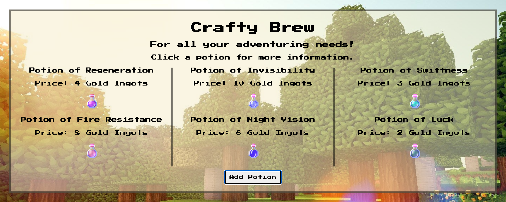
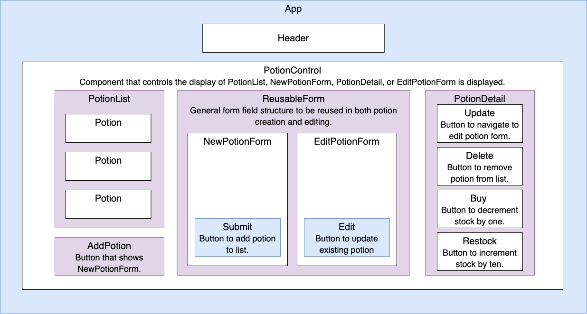

# **Crafty Brew**

### _React Fundamentals - Week 16 Project at Epicodus_

#### Author: **Jessica Hvozdovich**
#### July 2, 2020



### Description

_This application serves as a potion tracking app for a local adventure shop to monitor their product storage. The site is Minecraft themed and image resources are listed below. Full CRUD functionality with React is achieved using functional and class components, local and shared state, JSX, and props with PropTypes._

### Instructions for use:

1. Open Terminal (macOS) or PowerShell (Windows)
2. To download the project Directory to your desktop enter the following commands:
```
cd Desktop
git clone https://github.com/jhvozdovich/tap-room.git
cd tap-room
```
3. To view the downloaded files, open them in a text editor or IDE of your choice.
* if you have VSCode for example, when your terminal is within the main project Directory you can open all of the files with the command:
```
code .
```
4. Download node and node package manager if they are not already installed on your device. You can find further instructions [here](https://www.learnhowtoprogram.com/intermediate-javascript/getting-started-with-javascript-8d3b52cf-3755-481d-80c5-46f1d3a8ffeb/installing-node-js-14f2721a-61e0-44b3-af1f-73f17348c8f4).
5. Run npm install in your terminal to download the necessary dependencies, plugins, and modules.
```
npm install
```
6. The command npm run start will build and open the compiled code in a browser of your choice using a local host.
```
npm run start
```

### Known Bugs

* Troubleshooting div wrapping within columns. Exploring flexbox in css.
* Maintaining order after editing or updating potion.

### Support and Contact Information

Please contact me with any suggestions or questions at jhvozdovich@gmail.com. Thank you for your input!  
_Have a bug or an issue with this application? [Open a new issue](https://github.com/jhvozdovich/tap-room/issues) here on GitHub._

### Technologies Used

* React
* JSX
* JavaScript
* HTML
* Git and GitHub

### Project Structure



### Specs
| Spec | Input | Output |
| :------------- | :------------- | :------------- |
| **User can view a list of all available potions** | User Input:"localhost:3000" | Output: “Potion of Regeneration, Potion of Swiftness, Potion of Fire Resistance" |
| **Clicking on the potion displays details such as name, price, duration, effect, and stock** | User Input:"Click: Potion of Regeneration" | Output: “Name: Potion of Regeneration, Price: 4 gold ingots, Duration: 0:45, Effect: Restores 18 health over time, Stock: 10 bottles" |
| **User can access a form to add new potions to the list** | User Input:"Click: Add potion" | Output: “New potion form is displayed" |
| **User can add potions to the list via the form** | User Input:"Name: Potion of Night Vision, Price: 6 gold ingots, Duration: 3:00, Effect: Visually brightens everything to a light level of 15, Stock: 5 bottles" | Output: “Potion of Regeneration, Potion of Swiftness, Potion of Fire Resistance, Potion of Night Vision" |
| **User can decrement potion quantity with 'buy"** | User Input:"Potion Stock: 2, Click: Buy" | Output: “Potion Stock: 1" |
| **"Out of Stock" is displayed when there are no potions left and the quantity cannot be decremented below 0** | User Input:"Potion Stock: "Out of Stock" Click: Buy" | Output: “Sorry! You better restock those potions!" |
| **User can increase potion quantity with 'restock"** | User Input:"Potion Stock: 2, Click: Restock" | Output: “Potion Stock: 7" |
| **User can access a form to edit existing potions** | User Input:"Click: Edit Potion" | Output: “Edit potion form is displayed" |
| **User can edit potions via the form, empty fields retain their original information** | User Input:"Name: Potion of Seeing in the Dark"| Output: "Name: Potion of Seeing in the Dark, Price: 6 gold ingots, Duration: 3:00, Effect: Visually brightens everything to a light level of 15, Stock: 5 bottles" |
| **User can delete a potion** | User Input:"Click: Potion of Regeneration, Click: Delete" | Output: “Potion of Swiftness, Potion of Fire Resistance, Potion of Night Vision" |
| **An "Almost Out of Stock" warning appears when stock is below 10** | User Input:"Stock: 10, Click: Buy" | Output: “Stock: 9 Almost Out!" |

## Resources
* [Potion Images - Minecraft Sprites](https://minecraft.gamepedia.com/Potion#Potions_with_positive_effects)
* [Background Image](https://wallpapercave.com/minecraft-background-free)


#### License

This software is licensed under the MIT license.

Copyright © 2020 **_Jessica Hvozdovich_**
